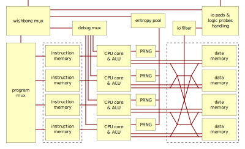

# TreePRAM

Parallel random access machines (PRAM) are a model of computation used in theoretical computer science. They consist of
several independent processors (random access machines) communicating with each other by sharing the same memory.

PRAMs offer a simple model to teach and understand parallel algorithms but they are impractical to implement in
hardware. Aside from the assumption of unbounded resources they obviously require a memory block with a large number of
IO buses. Since memory blocks typically have a single input and/or output bus, applications where parallel access to
the same memory block is required are forced to use workarounds. These include running memory logic at a higher clock
frequency or adding several copies of the memory block that are kept in sync, which correspond to a lower general speed
and higher die space respectively.

The model we implement in this project offers a compromise between the simplicity of PRAMs and the practical usability
of general-purpose processors. We add one memory block per core and allow them to be either kept in sync for simple
communication or used separately to maximize data storage per unit of die area. To achieve this we extend memory write
operations to include a _spread_ parameter besides the usual address and data. Processor cores are arranged in a binary
tree and spread controls how far the memory write operation spreads in this tree. For instance, if core 0 writes 17 to
memory address 8 with a spread of 2 then 17 is written to address 8 in the memory blocks of cores 0, 1, 2 and 3.
This logic can be turned into a combinatorial circuit between processor cores and memory blocks that we call the
_memory mesh_.

This repository contains a Verilog implementation of the TreePRAM model. It targets the OpenLane flow for the Skywater
130nm process and is an entry for the Google/Efabless MPW-3 shuttle. Source files live in `verilog/rtl` while the
user area of the hardened Caravel chip is available under `gds`. 

